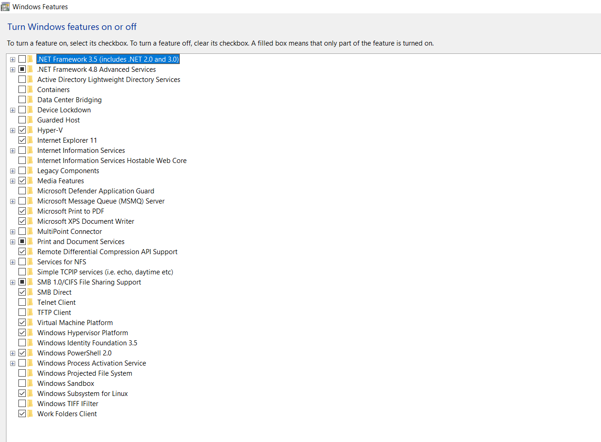

# Docker Setup and Installation
## Docker setup on Windows, Mac and Linux
### Docker WSL2/Linux subsystem on windows

- Install Docker Desktop on Window [Click here](https://docs.docker.com/desktop/windows/install/)
- Windows Hyper-v settings
.png)
- Linux subsystem options 

  ### Docker for Mac
  [Click here](https://docs.docker.com/desktop/mac/install/)

### Install and run Docker Desktop on Mac
Double-click Docker.dmg to open the installer, then drag the Docker icon to the Applications folder.

- Follow the steps
-  **Important**: Ensure to select your OS and chip i.e M1 chip

### Install Docker on Linux ubuntu
- `sudo apt-get remove docker docker-engine docker.io containerd runc`
- `sudo systemctl start docker`
- `sudo systemctl enable docker`
- Check status
- `sudo systemctl status docker`
- if you have TTY error use below command
- `alias docker="winpty docker"`

- `hello-world` 
- docker commands 
- `docker pull image-name`
- `docker run image-name`
- `docker build -t image-name`
- `docker push image-name`
- `docker run -d -p 2368:2368 ghost`
- how to check running container
- `docker ps` and `docker ps -a` 

### Docker container life cycle 
- `running state, stop and start`
  
- how can we interact with running container?
- 

